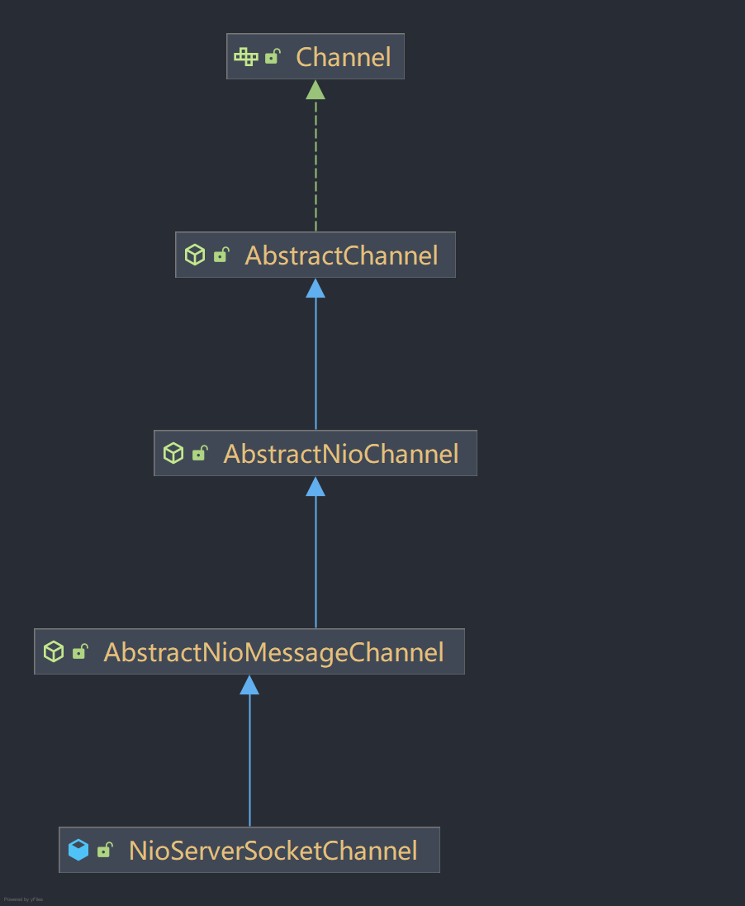
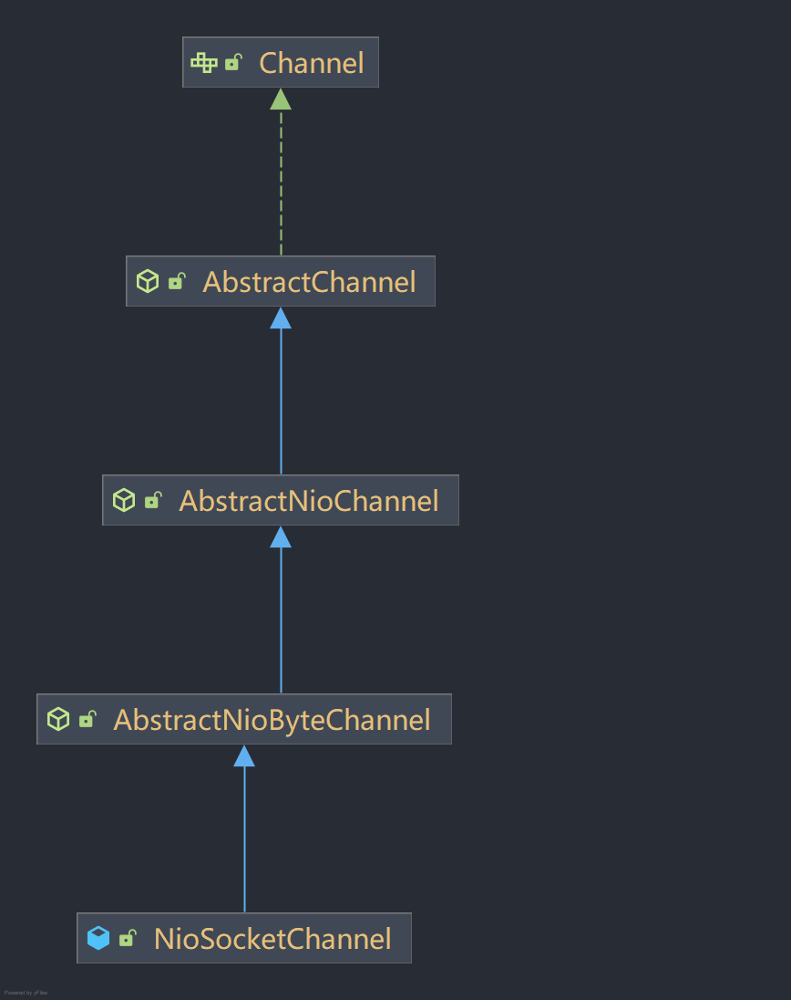
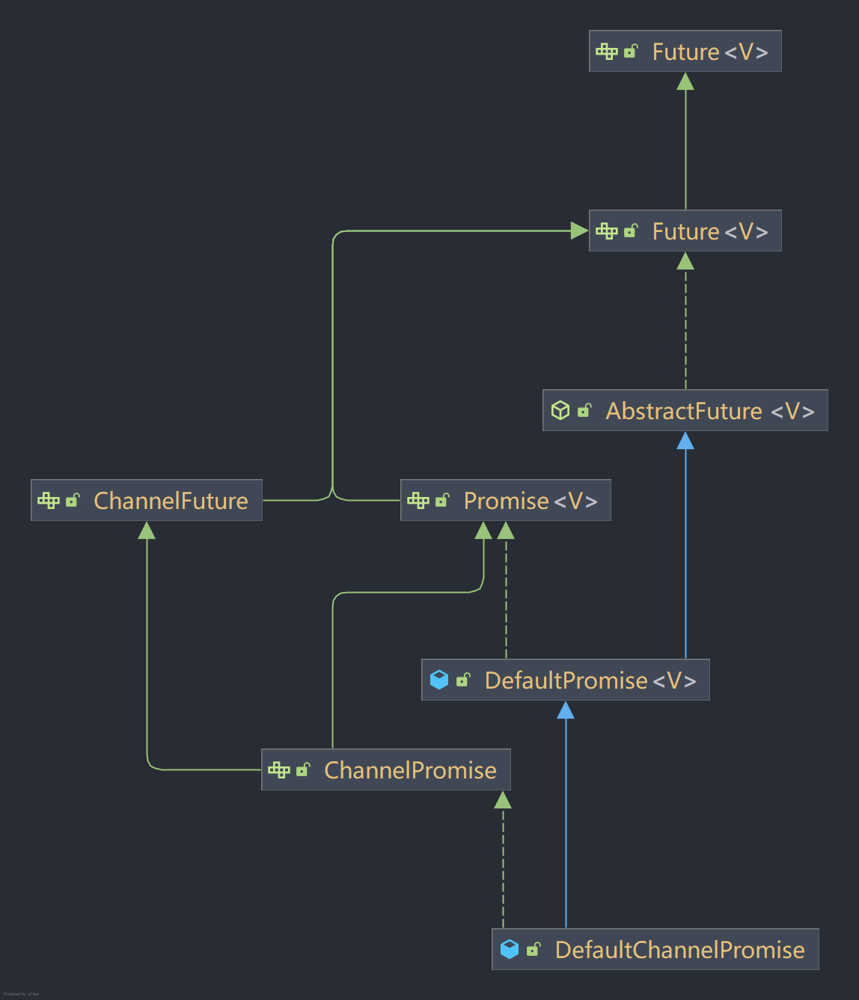
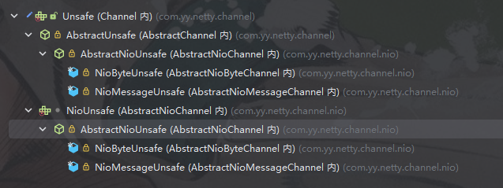
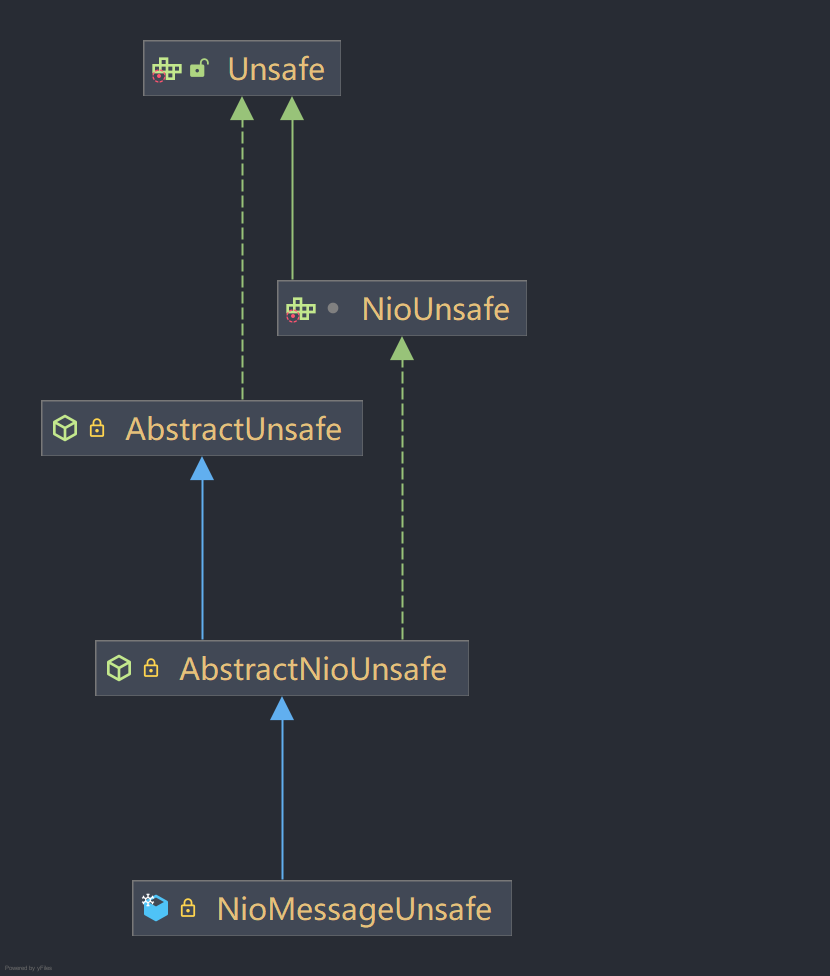
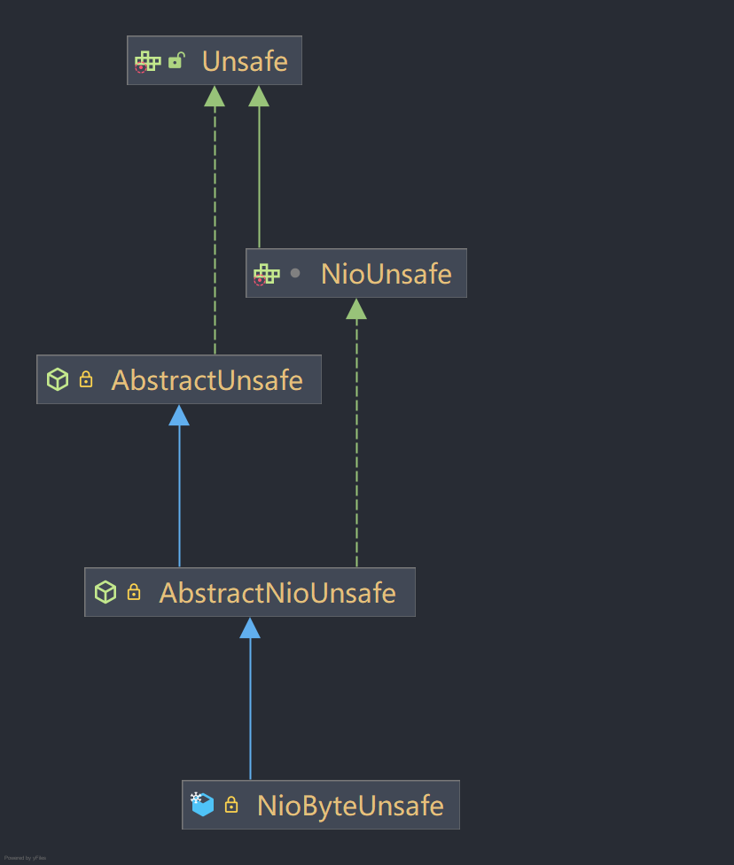

# Netty-ZeroToOne
从零到一手搓netty

**环境要求**：java8

## version-01
* **目标**：框架异步化初步抽象，初步构建Reactor模型；
* **设计与实现**：通过SingleThreadEventExecutor、SingleThreadEventLoop、NioEventLoop三层抽象，实现对事件的独立单线程异步处理；
* **功能与效果**：开放了IO事件的注册行为，单线程循环处理IO事件的注册任务+对IO事件的响应处理。最终通过构建不同的NioEventLoop即可处理不同的IO事件。使用案例和效果请参考ServerTest和ClientTest两个测试类。

## version-02
* **目标**：增加Group工作组的概念，提升框架并发处理能力
* **设计与实现**：在version-01版本的基础上抽象Group概念，以组的形式管理EventLoop，具体抽象层次如下所示：

  

    
     
    NioEventLoop抽象层次
  

  

    
     
    NioEventLoopGroup抽象层次
  

* **功能与效果**：
  * 服务端支持设置bossGroup和workGroup，以多线程组的方式分别处理服务端IO连接事件和IO读写事件；
  * 客户端支持设置workGroup，以多线程组方式处理客户端IO读写事件；
* **遗留问题**：NioEventLoop没有区分服务端和客户端，现在还是耦合在一起处理的，后续考虑做分离。

## version-03
* **目标**：构建线程间协调工具体系promise及其默认实现DefaultPromise
* **番外（顺手的事）**：手搓java源码FutureTask，感受java对线程协作工具的设计思路
* **设计与实现**：
  * 在java原生Future的基础上进行扩展，最终抽象出netty中的Promise接口，规范定义了用于在netty中的线程协作方法
  * 定义了FutureListener体系，并用于Promise中

  

    
     
    DefaultPromise抽象层次
  

  

    
     
    FutureListener监听器抽象层次
  

* **功能与效果**：promise的默认实现DefaultPromise支持如下线程协作方法
  * 任务结果设置：setSuccess、trySuccess、setFailure、tryFailure等方法
  * 任务查询：isSuccess、isCancellable、cause等方法
  * 任务设置：setUncancellable等方法
  * 任务取消：cancel等方法
  * 同步阻塞等待（支持无限等待阻塞，也支持指定超时时间阻塞）：await、sync等方法
  * 监听器设置：addListener、addListeners、removeListener、removeListeners等方法

## version-04
* **目标**：重构channel体系，NioEventLoop借助Channel体系，将IO事件委托给相应具体的channel来处理，解耦掉依赖具体NIO的Channel类型的逻辑，实现解耦。
结合第三版future协调器，扩展出channel的future体系。到这版完结为止，可正常完成服务端和客户端的连接了，服务端和客户端的数据传输安排到后面再去实现。
* **设计与实现**：完成对channel体系、channelFuture体系的抽象与重构，然后将NioEventLoop体系、Bootstrap、ServerBootstrap改造使用最新的channel体系。
channel体系有两个顶层实现类，分别对应服务端的NioServerSocketChannel和客户端的NioSocketChannel。channelFuture的默认实现类为DefaultChannelPromise。
NioServerSocketChannel、NioSocketChannel、DefaultChannelFuture三个类各自的抽象设计层次如下：

  

    
     
    NioServerSocketChannel抽象层次
  

  

    
     
    NioSocketChannel抽象层次
  

  

    
     
    DefaultChannelPromise抽象层次
  

* **功能与效果**：本迭代版本功能较第三版本没有太大区别，没有新增的功能，主要是对channel体系的重构，在整体架构上进行调整优化，为后续版本铺垫。使用案例和效果请参考ServerTest和ClientTest两个测试类。

## version-05
* **目标**：在channel体系中引入Unsafe设计模式，搞清楚Netty中Unsafe接口和其实现类的设计理念。明白设计这样一个东西只是为了让channel中的方法执行的时候经过后续待设计出来的ChannelPipeline。
进而在ChannelPipeline中会进一步调用Unsafe的方法。在本版本中channel的很多方法实现都会移动到Unsafe接口实现类中，但是channel中又会保留部分方法，channel中这部分保留的本来的方法实现待后续结合ChannelPipeline体系进行完善。
* **设计与实现**：Unsafe的继承体系伴随着channel体系进行抽象和实现，具体抽象关系如下：

  

    
     
    Unsafe体系与Channel体系的依附关系
  

  

    
     
    NioMessageUnsafe抽象层次
  

  

    
     
    NioByteUnsafe抽象层次
  

* **功能与效果**：在Netty中，bind、read、connect、writeAndFlush等多种方法都会经过ChannelPipeline，然后在ChannelPipeline的处理器中调用unsafe对象的方法，
在unsafe对象的方法内，就可以进一步执行到各种channel实现类中以do开头的各种真正干活的方法中了。直接使用unsafe的方法被认为是'不安全'的。

## version-05
* **目标**：在版本5的基础上增加客户端的write数据发送能力，服务端接受到客户端channel后的绑定和读数据接收能力待后续进一步完善。
* **设计与实现**：实现ChannelOutboundInvoker接口的writeAndFlush方法，实现Unsafe的write方法，最终在NioSocketChannel中实现doWrite方法
* **功能与效果**：客户端端连接至服务端后，发送数据到服务端，证明客户端的write能力正常。

