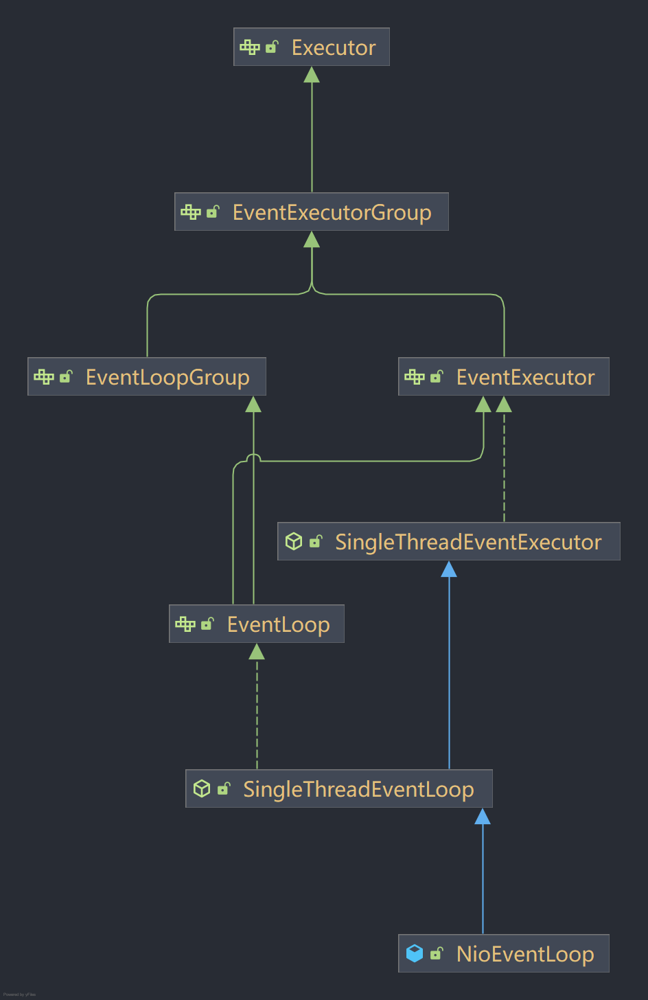
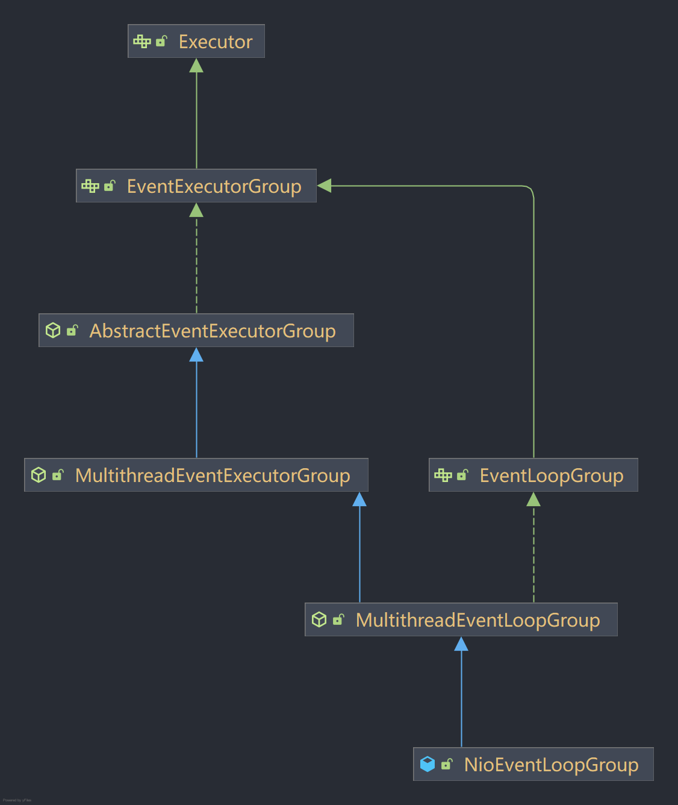
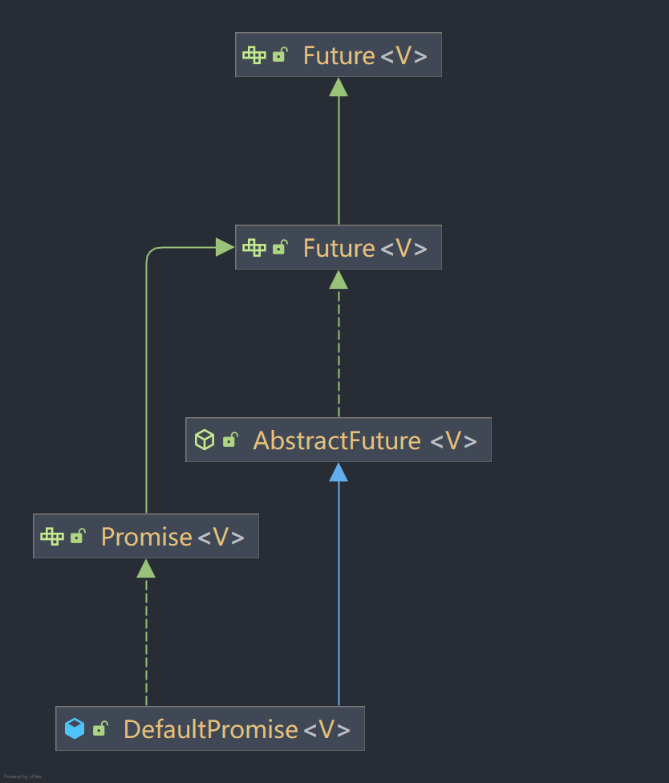
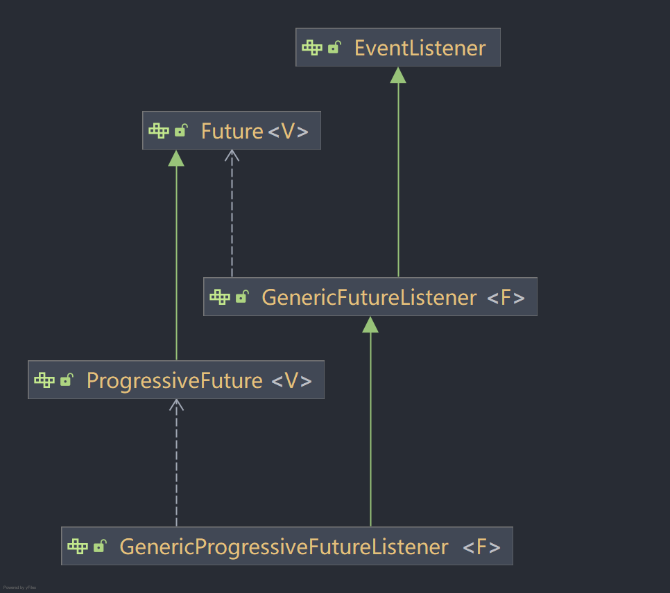

# Netty-ZeroToOne
从零到一手搓netty

**环境要求**：java8

## version-01
* **目标**：框架异步化初步抽象，初步构建Reactor模型；
* **设计与实现**：通过SingleThreadEventExecutor、SingleThreadEventLoop、NioEventLoop三层抽象，实现对事件的独立单线程异步处理；
* **功能与效果**：开放了IO事件的注册行为，单线程循环处理IO事件的注册任务+对IO事件的响应处理。最终通过构建不同的NioEventLoop即可处理不同的IO事件。使用案例和效果请参考ServerTest和ClientTest两个测试类。

## version-02
* **目标**：增加Group工作组的概念，提升框架并发处理能力
* **设计与实现**：在version-01版本的基础上抽象Group概念，以组的形式管理EventLoop，具体抽象层次如下所示：

  

    
     
    NioEventLoop抽象层次
  

  

    
     
    NioEventLoopGroup抽象层次
  

* **功能与效果**：
  * 服务端支持设置bossGroup和workGroup，以多线程组的方式分别处理服务端IO连接事件和IO读写事件；
  * 客户端支持设置workGroup，以多线程组方式处理客户端IO读写事件；
* **遗留问题**：NioEventLoop没有区分服务端和客户端，现在还是耦合在一起处理的，后续考虑做分离。

## version-03
* **目标**：构建线程间协调工具体系promise及其默认实现DefaultPromise
* **番外（顺手的事）**：手搓java源码FutureTask，感受java对线程协作工具的设计思路
* **设计与实现**：
  * 在java原生Future的基础上进行扩展，最终抽象出netty中的Promise接口，规范定义了用于在netty中的线程协作方法
  * 定义了FutureListener体系，并用于Promise中

  

    
     
    DefaultPromise抽象层次
  

  

    
     
    FutureListener监听器抽象层次
  

* **功能与效果**：promise的默认实现DefaultPromise支持如下线程协作方法
  * 任务结果设置：setSuccess、trySuccess、setFailure、tryFailure等方法
  * 任务查询：isSuccess、isCancellable、cause等方法
  * 任务设置：setUncancellable等方法
  * 任务取消：cancel等方法
  * 同步阻塞等待（支持无限等待阻塞，也支持指定超时时间阻塞）：await、sync等方法
  * 监听器设置：addListener、addListeners、removeListener、removeListeners等方法

## version-04
* **目标**：重构channel体系，在NioEventLoop中解耦掉依赖具体NIO的Channel类型的逻辑，结合第三版future协调器，完成对channel体系的重塑。到这版完结为止，可正常完成服务端和客户端的连接了，服务端和客户端的数据传输安排到后面再去实现。
* **设计与实现**：完成对channel体系、channelFuture体系的抽象与重构，然后将NioEventLoop体系、Bootstrap、ServerBootstrap改造使用最新的channel体系。channel体系、channelFuture体系的抽象层次如下所示：todo
* **功能与效果**：本迭代版本功能较第三版本没有太大区别，没有新增的功能，主要是对channel体系的重构，在整体架构上进行调整优化，为后续版本铺垫。使用案例和效果请参考ServerTest和ClientTest两个测试类。

